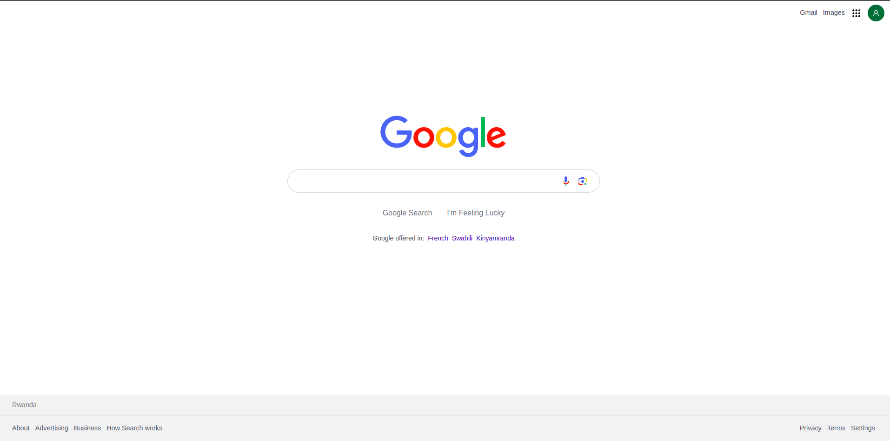

# Gymn challenge

This is a [Vite] [React] and bootstrapped with [yarn create vite]()

# the-gym-google-clone

## Welcome! 👋

This is a solution to the Gym Traning. The Gym challenge help us to improve our front-end skills by building realistic projects.
In this exercise, we will use React and tailwindcss.

## Content

- [the-gym-google-clone](#)
- [Welcome! 👋](#)
- [The challenge](#)
- [Screenshot](#screenshot)
- [Links](#links)
- [My Steps]()
- [Author](#author)

### The challenge

The-gym-stripe-clone
Users should be able to:

- You have got 4 hours to complete this challenge, so try to reach as much perfection as possible for this challenge!
- Try to implement the design below, using only React and Tailwindcss,
- Use tailwind as much as possible. Only use custom CSS when you absolutely have to. In that case, structure your custom CSS in BEM.
- When you start the project, immediately create a "development" branch where you will do all your coding,

### Screenshot

### Links

- Live Site URL Open [google clone]() with your browser to see the result.

## My process

- React
- Tailwind
- Mobile-first workflow